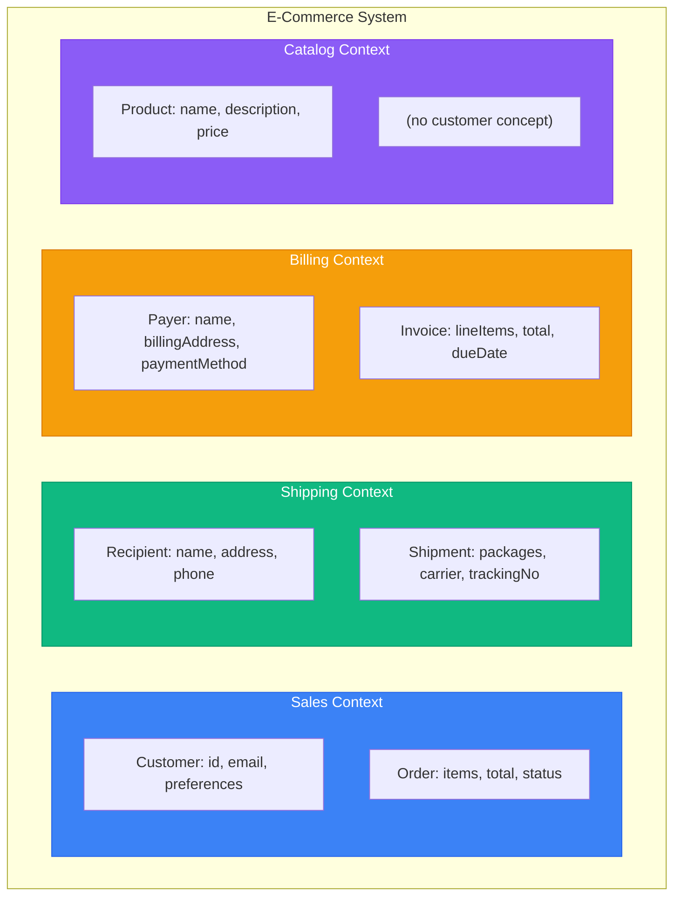
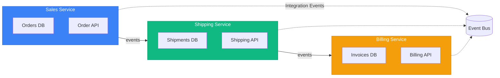
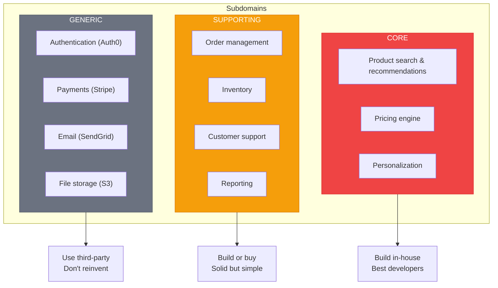

# DDD Strategic Patterns

> Sources:
> - [Domain-Driven Design: The Blue Book](https://www.domainlanguage.com/ddd/blue-book/) — Eric Evans (2003)
> - [DDD Resources](https://www.domainlanguage.com/ddd/) — Domain Language (Eric Evans)
> - [Bounded Context](https://martinfowler.com/bliki/BoundedContext.html) — Martin Fowler
> - [Domain Driven Design](https://martinfowler.com/bliki/DomainDrivenDesign.html) — Martin Fowler
> - [Anti-Corruption Layer](https://docs.aws.amazon.com/prescriptive-guidance/latest/cloud-design-patterns/acl.html) — AWS
> - [Domain Analysis for Microservices](https://learn.microsoft.com/en-us/azure/architecture/microservices/model/domain-analysis) — Microsoft

## Overview

Strategic DDD patterns help decompose large systems into manageable parts with clear boundaries. They answer: **"How do we divide a complex domain?"**

**DDD is fundamentally collaborative.** The patterns below emerge from conversations, whiteboarding, and modeling sessions with domain experts—not from coding alone.

---

## Ubiquitous Language

The foundation of DDD. A shared vocabulary between developers and domain experts that appears in:
- Code (class names, method names)
- Documentation
- Conversations
- UI labels

### Principles

1. **One language per bounded context** - Different contexts may use the same word differently
2. **Code reflects the language** - `Order.confirm()` not `Order.setStatus("confirmed")`
3. **Evolve together** - When language changes, code changes

### Example

```
❌ Technical language:
   "Set the order entity's status field to 2 and insert a record"

✅ Ubiquitous language:
   "Confirm the order and record that it was confirmed"
```

```typescript
// ❌ Technical, not ubiquitous
class Order {
  setStatus(status: number): void { this.status = status; }
}

// ✅ Ubiquitous language
class Order {
  confirm(): void {
    if (this.status !== OrderStatus.Pending) {
      throw new OrderCannotBeConfirmedException(this.id);
    }
    this.status = OrderStatus.Confirmed;
    this.confirmedAt = new Date();
    this.addDomainEvent(new OrderConfirmed(this.id));
  }
}
```

---

## Bounded Contexts

A **semantic boundary** where a particular domain model applies. Within a bounded context, terms have precise, unambiguous meaning.

> **Key insight:** Polysemy (same word, different meanings) across departments is natural, not a problem. The same term meaning different things in different contexts is expected—"the dominant boundary factor is human culture and language variation." — Martin Fowler

### Key Concepts

- Each bounded context has its **own ubiquitous language**
- Each bounded context has its **own model**
- The same real-world concept may have **different representations** in different contexts

### Example: E-Commerce System



**"Customer" means different things:**
- **Sales**: Email, preferences, order history
- **Shipping**: Delivery address, phone number
- **Billing**: Payment methods, billing address

### Bounded Context = Microservice Boundary

In microservices, each bounded context typically becomes a separate service:



---

## Subdomains

Areas of business expertise. Subdomains are **discovered**, not designed.

### Types

| Type | Description | Investment | Example |
|------|-------------|------------|---------|
| **Core** | Competitive advantage | High | Product recommendation engine |
| **Supporting** | Necessary but not unique | Medium | Order management |
| **Generic** | Commodity, buy/outsource | Low | Email sending, payments |

### Identification Questions

1. What makes us different from competitors? → **Core**
2. What do we need but isn't our specialty? → **Supporting**
3. What does everyone need the same way? → **Generic**

### Example: E-Commerce


