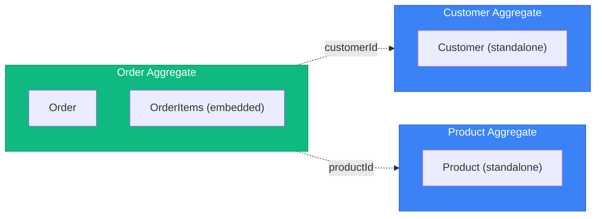
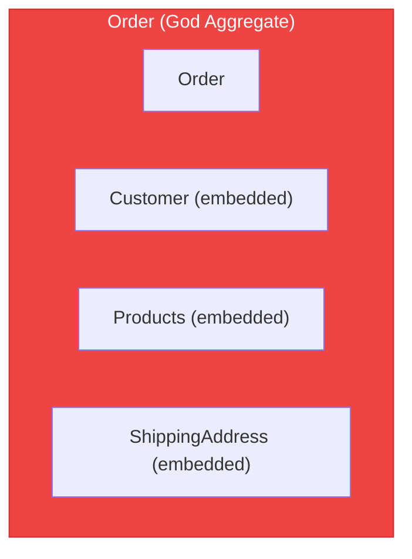

# DDD Tactical Patterns

## Entity

An object with **identity** that persists through time. Two entities are equal if they have the same identity, regardless of attribute values.

### Characteristics

- Has a unique or composite identifier
- Identity persists through lifecycle
- Can change attributes but remains the same entity
- Contains behavior (not just data)

### Pattern

```php
class MarkbookGroup
{
    public static function fromStudent(int $index, Student $student): self
    {
        return new self($index, $student->id(), []);
    }

    public static function fromState(array $data): self
    {
        return new self(
            $data['number'],
            StudentId::from($data['student_id']),
            $data['marks']
        );
    }

    private function __construct(
        public readonly int $number,
        public readonly StudentId $studentId,
        /** @var int[] */
        private array $marks,
    ) { }

    public function marks(): array
    {
        return $this->marks;
    }

    private function changeMarks(array $marks): void
    {
        Assert::allNullOrNumeric($marks);
        
        $this->marks = $marks;
    }

    public function state(): array
    {
        return [
            'number' => $this->number,
            'marks' => $this->marks,
            'student_id' => (string) $this->studentId,
        ];
    }
}
```

---

# Value Object

An object defined by its **attributes**, not identity. Two value objects are equal if all their attributes are equal.

## Characteristics

- Immutable (no setters)
- No identity
- Equality by value (all attributes)
- Self-validating
- Side-effect-free methods

## Common Value Objects

| Value Object | Attributes | Validation |
|--------------|-----------|------------|
| Money | amount, currency | amount >= 0 |
| Email | address | valid email format |
| Address | street, city, zip, country | required fields |
| DateRange | start, end | start <= end |
| Quantity | value | value > 0 |

## Pattern

```php
class Resource
{
    public const TYPE_TEST = 'test';
    public const TYPE_GUIDANCE = 'guidance';
    public const TYPE_OTHER = 'other';
    
    public function __construct(    
        public readonly string $type,
        public readonly string $fileName,
        public readonly string $path,
    ) {
        Assert::oneOf($type, [self::TYPE_TEST, self::TYPE_GUIDANCE, self::TYPE_OTHER]);
        Assert::minLength($this->fileName, 8);
        Assert::notEmpty($this->path);
    }

    public function fileNameByPath($path): string
    {
        return pathinfo(parse_url($path, PHP_URL_PATH), PATHINFO_BASENAME);
    }
}
```

---

# Aggregate

A cluster of entities and value objects treated as a single unit for data changes. Has a **consistency boundary**.

## Rules

1. **One aggregate root** - Single entry point for all modifications
2. **Reference by ID only** - Aggregates reference others by identity, never by direct object reference
3. **Transaction boundary** - One aggregate per transaction (eventual consistency between aggregates)
4. **Invariants within boundary** - Aggregate ensures its own consistency
5. **Small aggregates** - Prefer smaller over larger
6. **Unique ID** - Aggregate identity is based on **UUIDv6**
7. **Repository saved** - aggregate rules have a repository and its state is only stored via a `save()` method.
8. **Provider queried** - read model of aggregates are queried via specific provider methods (e.g. `byId()`).

## Aggregate Sizing Heuristics

| Metric | Healthy | Warning | Action |
|--------|---------|---------|--------|
| Entities per aggregate | 1-5 | 6-10 | >10: Split |
| Lines of code (root) | <500 | 500-1000 | >1000: Split |
| Transaction lock time | <100ms | 100-500ms | >500ms: Split |
| Concurrent modification conflicts | Rare | Occasional | Frequent: Split |

**Questions to ask:**
- Can parts be eventually consistent? → Separate aggregates
- Do all parts change together? → Same aggregate
- Are there independent lifecycles? → Separate aggregates

## Design Guidelines

**Good: Small Aggregates**



*Reference by ID only*

**Bad: God Aggregate**



*Too large, too many reasons to change, contention issues*

## Pattern

```php
trait RecordsEvents
{
    /** @var DomainEvent[] */
    private array $events = [];
    
    private function recordThat(DomainEvent $event): void
    {
        $this->events[] = $event;
    }

    public function getRecordedEvents(): array
    {
        return $this->events;
    }

    public function clearRecordedEvents(): void
    {
        $this->events = [];
    }
}

class Markbook
{
    use RecordsEvents;

    public static function fromTeachingGroup(TeachingGroup $teachingGroup): self
    {
        return new self(
            MarkbookId::create(),
            $teachingGroup->id(),
            array_map(static fn (array $student, int $index) => MarkbookGroup::fromStudent($index, $student), $teachingGroup->students()),
        );
    }

    public static function fromState(array $data): self
    {
        return new self(
            MarkbookId::from($data[0]['markbook_id']),
            TeachingGroupId::from($data[0]['teaching_group_id']),
            array_map(static fn (array $group) => MarkbookGroup::fromState($group), $data),
            $data[0]['submit'],
            $data[0]['created_at'],
        );
    }
    /** @var MarkbookGroup[] */
    private array $groups;

    private function __construct(
        private readonly MarkbookId $id,
        private readonly TeachingGroupId $teachingGroupId,
        array $groups,
        private readonly \DateTimeImmutable $createdAt = new \DateTimeImmutable(),
        private bool $submit = false,
    ) {
        foreach ($groups as $group) {
            $this->groups[(string) $group->studentId()] = $group;
        }
    }

    /**
     * @return MarkbookGroup[]
     */
    public function groups(): array
    {
        return $this->groups;
    }

    public function rawScores(): array
    {
        $scores = [Tier::FOUNDATION => [], Tier::HIGHER => []];

        if (!$this->isSubmitted()) {
            return $scores;
        }

        foreach ($this->groups() as $group) {
            if (!$group->isAbsent()) {
                $scores[$group->tier()][] = [$group->rawScore(), $group->coreScore()];
            }
        }

        return $scores;
    }

    public function isSubmitted(): bool
    {
        return $this->submit;
    }

    public function changeMarks(StudentId $studentId, array $marks): void
    {
        Assert::keyExists($this->groups, (string) $studentId);

        $this->groups[(string) $studentId]->changeMarks($marks);

        $this->recordThat(new MarkbookHasChanged($this->id));
    }

    public function submit(): void
    {
        $this->submit = true;
    }

    public function state(): array
    {
        return [
            'id' => $this->id,
            'markbook' => [
                'markbook_id' => $this->id,
                'teaching_group_id' => (string) $this->teachingGroupId,
                'submit' => $this->submit,
                'created_at' => $this->createdAt,
            ],
            'groups' => array_map(static fn (MarkbookGroup $group) => $group->state(), $this->groups),
        ];
    }
}
```

---

# Repository

Provides collection-like access to aggregates. Abstracts persistence.

## Rules

1. **One repository per aggregate** - Not per entity or table
2. **Aggregate-focused** - Save/load entire aggregates

## Pattern

```
interface OrderRepository:
    findById(id: OrderId) -> Order | null
    findByCustomerId(customerId: CustomerId) -> List<Order>
    save(order: Order)
    delete(order: Order)
    nextId() -> OrderId

interface Repository<T extends AggregateRoot<ID>, ID>:
    findById(id: ID) -> T | null
    save(aggregate: T)
    delete(aggregate: T)
```

## Common Mistakes

**Wrong: Repository per entity**

```
interface OrderItemRepository:
    findByOrderId(orderId) -> List<OrderItem>
    save(item: OrderItem)
```

**Wrong: Query methods in repository**

```
interface OrderRepository:
    findByStatus(status) -> List<Order>
    findByDateRange(start, end)
    countByCustomer(customerId)
```

**Correct: Aggregate-focused + separate read model**

```
interface OrderRepository:
    findById(id: OrderId) -> Order | null
    save(order: Order)

interface OrderReadModel:
    findByStatus(status) -> List<OrderSummaryDTO>
    findByDateRange(start, end) -> List<OrderSummaryDTO>
    countByCustomer(customerId) -> int
```

---

# Domain Event

Records something significant that happened in the domain.

## Characteristics

- Immutable
- Past tense naming (`OrderPlaced`, not `PlaceOrder`)
- Contains data needed by consumers
- Timestamp when it occurred

## Pattern

```php
```

---

# Domain Service

Stateless operations that don't naturally fit within an entity or value object.

## When to Use

- Operation involves multiple aggregates
- Operation requires external information
- Significant business logic that doesn't belong to one entity

## Pattern

```php
```

---

# Factory

Encapsulates complex aggregate/entity creation.

## When to Use

- Creation logic is complex
- Need to enforce invariants during creation
- Need to create object graphs

## Pattern

```php
```
